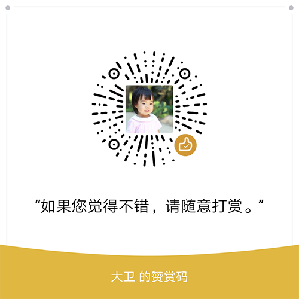

# 说明

达达秒送开放平台SDK，首个版本发布于2025年8月1日

## 安装

`composer require ledc/dada`

## 使用说明

### 实例化SDK，调用达达接口

```php
use Ledc\Dada\Config;
use Ledc\Dada\Dada;

// 数据库或环境变量内的配置信息
$config = [
    'appKey' => 'app_key 应用ID',
    'appSecret' => 'app_secret 应用密钥',
    'sourceId' => 'source_id 商户编号',
    'sourceIdTest' => 'source_id 商户编号（测试环境）',
    'shopNoTest' => 'shop_no 门店编号（测试环境）',
    'timeout' => 10,
    'debug' => true,
    'enabled' => true,
];

$dada = new Dada(new Config($config));
```

在创建实例后，所有的方法都可以由IDE自动补全；例如：

```php
/** @var \Ledc\Dada\Dada $dada */

// 获取达达秒送HTTP客户端（处理了签名逻辑），可以直接调用达达全部接口
$client = $dada->getClient();

// 封装的商户管理接口
$merchant = $dada->merchant();

// 封装的订单管理接口
$order = $dada->order();

// 封装的账户管理接口
$account = $dada->account();
```

### 创建回调通知报文对象

```php
// ThinkPHP 框架示例
$payload = request()->post(false);
// webman 框架示例
$payload = request()->post(null);

// 创建回调通知报文对象
$notify = \Ledc\DaDa\CallbackFactory::create($payload);
```

## 官方文档

https://newopen.imdada.cn

## 回调相关

### 订单状态回调

https://newopen.imdada.cn/#/development/file/order

创建达达物流订单后，在每次订单状态发生变化时，达达会将状态回调至新增订单接口callback传入的URL，订单状态流转见订单流转。

1. 已取消=5：包括配送员取消、商户取消、客服取消、系统取消（比如：骑士接单后一直未取货）， 此时订单的状态为已取消，可以通过“重新发单”来下发订单；
2. 妥投异常之物品返回中=9：配送员在收货地，无法正常送到用户手中（包括用户电话打不通、客户暂时不方便收件、客户拒收、货物有问题等等）；
3. 创建达达运单失败=1000：表示因为达达内部服务异常，导致下发订单失败。可以通过“新增订单”来下发订单；
   4.订单状态回传顺序：配送员自身原因取消运单后重抛场景下，会出现状态重复回传，比如骑士A在待取货状态下取消运单，重抛后会重推待接单状态，重复回传状态原因为1-重新分配骑士；骑士转单场景下，会出现订单状态重推，比如骑士A在待取货状态下转单给骑士B，会重推待取货状态，重复回传状态原因为2-骑士转单，并回传骑士B信息。历史注册开发者系统如支持重复状态回传可在开发助手-应用信息中开启【重复订单状态回调通知】开关，否则不重复回传，新注册开发者默认会回调。

-------

1.登陆开发者账户，在【开发助手-日志查询】中可以查询订单回调信息
2.登录开发者账号，在【管理中心-开发助手-联调工具】中联调订单回调

### 骑士申请取消订单

骑士异常上报申请取消订单消息通知，该消息默认不通知，如系统及业务侧具备审核能力，请联系业务经理进行开通；回调地址URL请登录开发者账号，在【开发助手-应用信息】中进行配置。

https://newopen.imdada.cn/#/development/file/applicationCancel

https://newopen.imdada.cn/#/development/file/transporterCancelOrder

### 门店信息变更通知

https://newopen.imdada.cn/#/development/file/shopMessageChangePost

部分门店信息发生变更场景会通过该接口通知，门店状态变更场景说明：

1.门店运力审核流程，如门店运力审核失败则门店自动下线，如审核通过则门店自动上线
2.运营操作门店上下线

-------

回调地址URL请登录开发者账号，在【开发助手-应用信息】中进行配置。

## 捐赠


